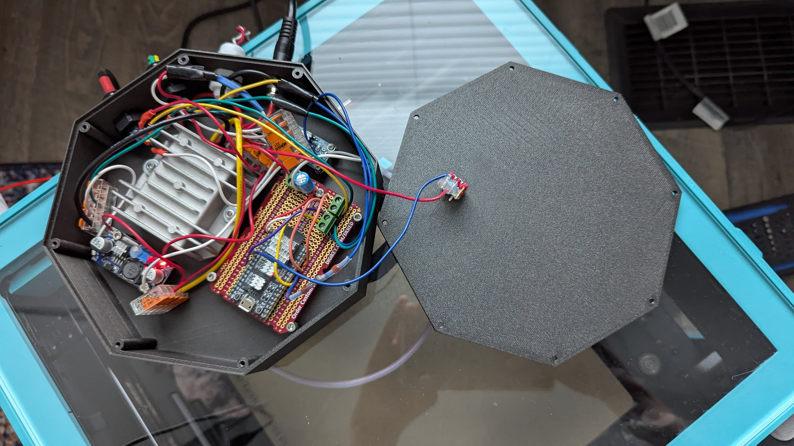
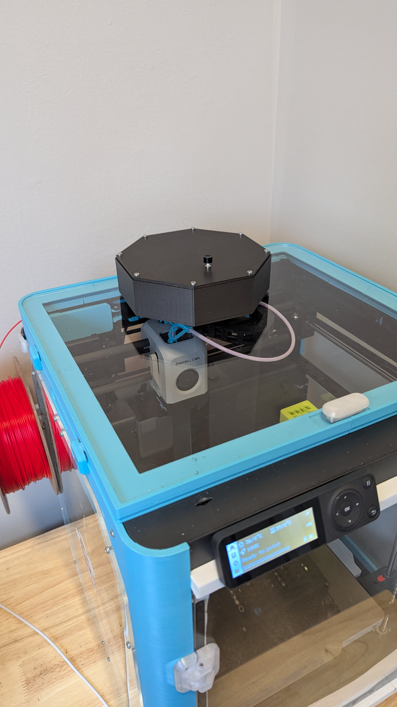
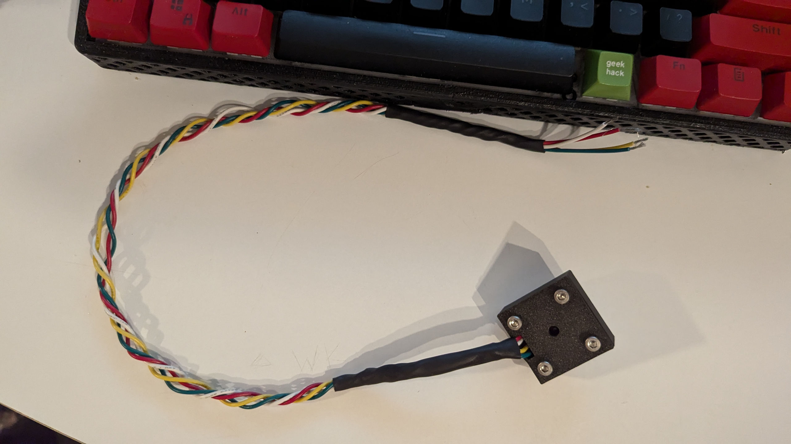

### Bambu Printer air filter controller

This is the code for my air filtration control system. It is designed to integrate with a Bambu printer and control an air filtration system, e.g. a Bento Box air filter

It uses two sensors, one for air temperature and humidity, and one for VOCs.
The temperature/humidity sensor is used to calibrate the VOC sensor.

It is designed to allow you to to integrate with the MQTT server built into
Bambu printers.

It also has a JSON based HTTP api which lets you configure thresholds for when
the air filter will run (which is controlled by MOSFETs)

### Configure the project
Run `idf.py menuconfig` and set the variables in the fan controller config
section.

E.g.
WiFI SSID: `<your wifi SSID>`

WiFI Password: `<your wifi password>`

Maximum WiFI Retry Count: `10`

Broker URI: `mqtts://bblp:<password>@192.168.0.186:8883`

Device Serial Number: `<your serial number>` (can be obtained from the printer itself)

### Build and Flash

Build the project and flash it to the board, then run the monitor tool to view the serial output:

Run `idf.py -p PORT flash monitor` to build, flash and monitor the project.

(To exit the serial monitor, type ``Ctrl-]``.)

See the [Getting Started Guide](https://docs.espressif.com/projects/esp-idf/en/latest/get-started/index.html) for full steps to configure and use ESP-IDF to build projects.

### Photos
#### Patially assembled with DC to DC converters that run on the printer's power supply

#### The controller completely installed and sitting on top of the printer itself.

#### The VOC sensor with a case I printed for it.

## Hardware I used
- esp32 development board (any of them will do, but the pinout varies between them so you have to figure that out yourself)
- sht-30 temperature and humidity sensor [from here](https://www.adafruit.com/product/4099)
- DC-DC converter that takes the 24v from the printer power supply, from [here](https://www.digikey.ca/en/products/detail/sparkfun-electronics/COM-18376/15195189)
- Fans [like these](https://www.digikey.ca/en/products/detail/wakefield-vette/DC0402012V2B-2T0/11593034) which run on 12v directly from the fan controller.
- For controlling the fans you can use any MOSFETs that have a suitable gate threshold voltage (VGS) of 3v and can handle the amount of voltage and current needed to run the fans.
- For powering the microcontroller you need another buck converter which will connect to the larger one and drop it down to 3v. E.g. any of [these](https://www.amazon.ca/BULVACK-LM2596-Converter-Module-1-25V-30V/dp/B07VVXF7YX) would work.
